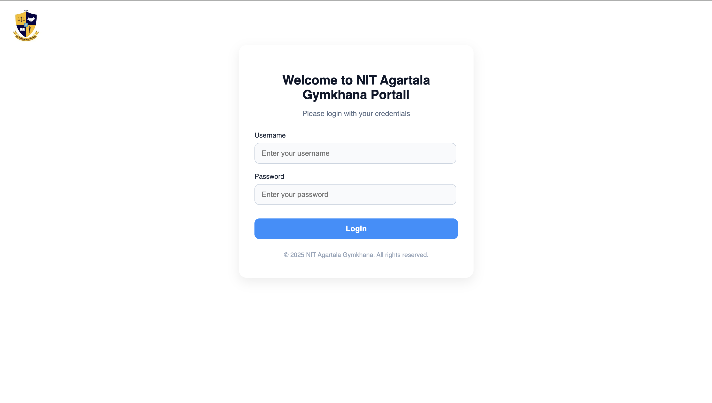
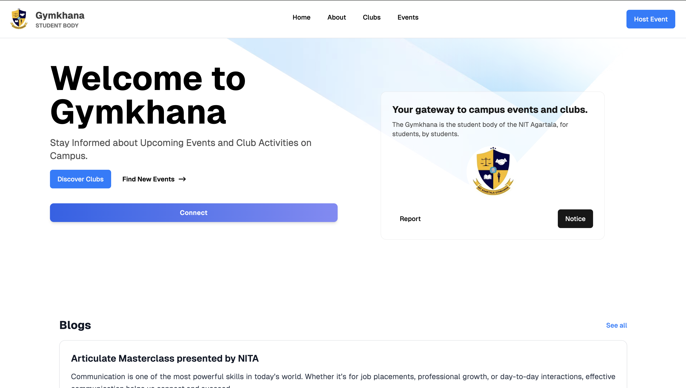
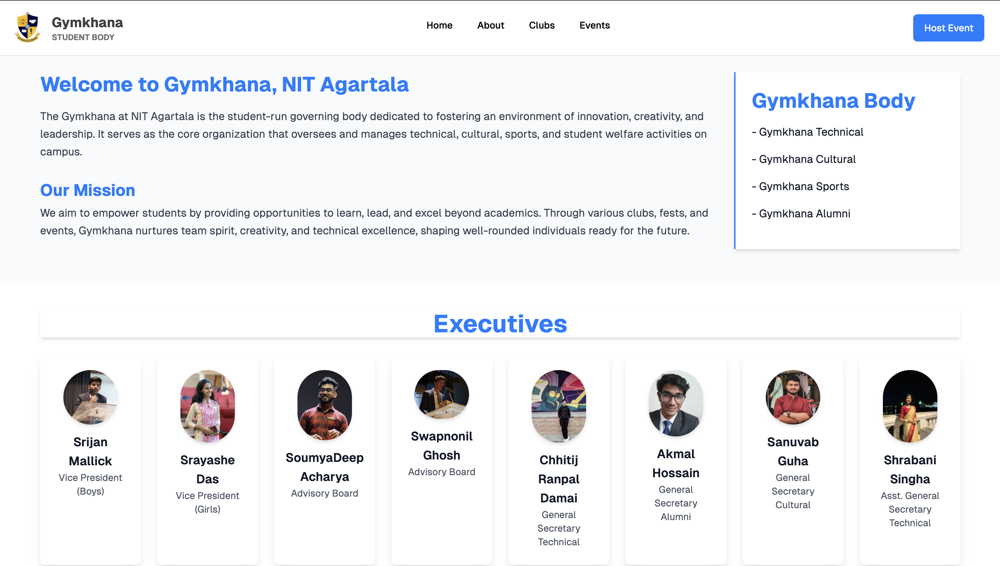
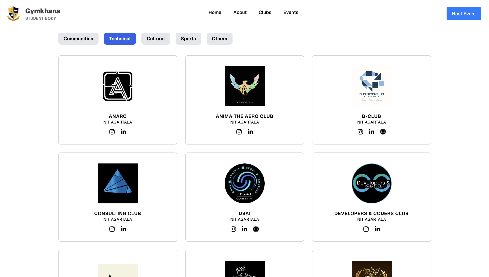

# 🏛️ NIT Agartala Gymkhana Portal

A full-stack **Gymkhana Management Website** for **NIT Agartala**, built to centralize information about clubs, executives, events, and campus activities.  
Designed **for students, by students**, the platform provides a clean, modern, and scalable interface to improve student engagement across campus.

---

## 🚀 Tech Stack

### Frontend
- **React.js**
- **TypeScript**
- **Next.js** (used in some legacy / initial parts)
- Component-based architecture
- Responsive UI

### Backend
- **Node.js**
- **Express.js**
- RESTful APIs

### Tools & Practices
- Git & GitHub
- Modular folder structure
- Frontend–Backend separation
- Scalable and maintainable design

---

## ✨ Features

- 🔐 **Authentication System** (Gymkhana Login Portal)
- 🏠 **Landing Page** with Gymkhana overview
- 👥 **Executives Section** showcasing office bearers
- 🏢 **Clubs Directory**
  - Technical
  - Cultural
  - Sports
  - Others
- 📅 **Events & Notices**
- 📝 **Blogs & Updates**
- 🎯 **Host Event** functionality for authorized users

---

## 🖼️ Screenshots

> 📌 All images are stored inside the `screenshots/` folder

### 🔐 Login Portal


### 🏠 Gymkhana Home Page


### 👥 Executives Section


### 🏢 Clubs Directory


---

## 📂 Project Structure

```bash
Gymkhana-Website/
├── frontend/
│   ├── components/
│   ├── pages/
│   ├── hooks/
│   ├── styles/
│   └── utils/
|
├── screenshots/
│   ├── login.png
│   ├── home.png
│   ├── executives.png
│   └── clubs.png
│
├── README.md
└── package.json
